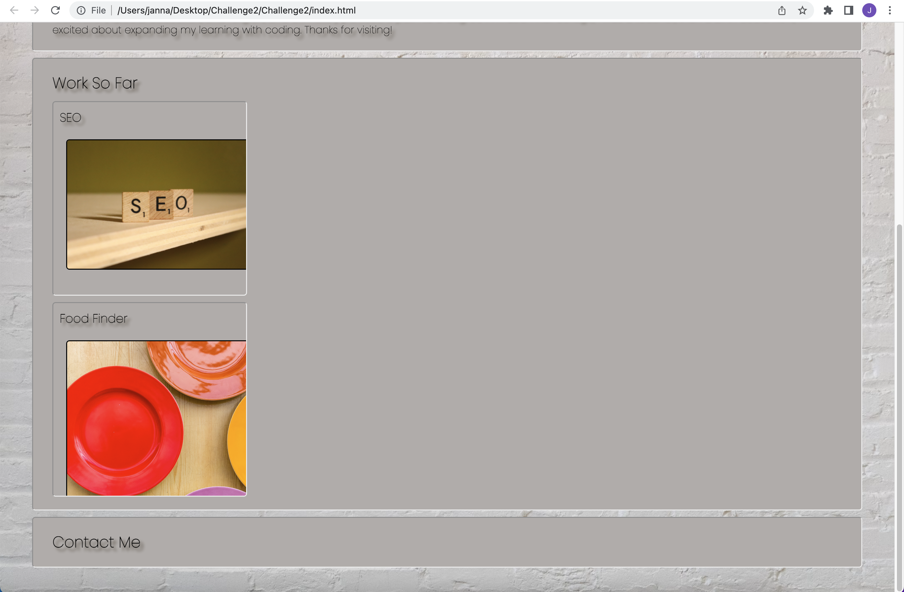

# <Challenge2>

## This professional porfolio was created in order to showcase HTML & CSS skills and past, current, and a place for future professional development.

The motivation for this project was to fulfill the need of displaying professional progress and development in an organized way that helps the developer grow and make connections. It solves the problem of having work scattered about and puts it all in one organized place that will help the developer reflect and share their work with others. Now, I have a better understanding of what to include in a professional profile, why it's important and how to organize it.

## Installation

NA

## Usage
  
To use this site, click on the links in the nav bar, which will automatically take you to the corresponding section of the page. There, you'll find information you can either read or click to explore other sites that are a part of the portfolio.
  

To add a screenshot, create an `assets/images` folder in your repository and upload your screenshot to it. Then, using the relative file path, add it to your README using the following syntax:

  

## Credits

NA

## License

Please refer to the lisence in the repo.